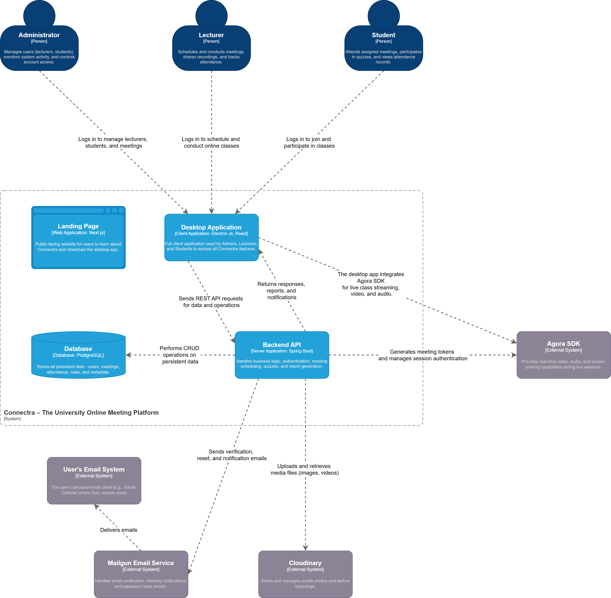

<div align="center">
  
  <h1>Connectra Backend</h1>
  <p>REST API for the University Online Meeting Platform</p>
</div>

<p align="center">
  
  
  
  
</p>

---

## Table of Contents

- [About](#about)
- [Features](#features)
- [Architecture](#architecture)
- [Technology Stack](#technology-stack)
- [API Endpoints](#api-endpoints)
- [Project Structure](#project-structure)
- [Getting Started](#getting-started)
- [Configuration](#configuration)
- [Deployment](#deployment)

---

## About

Connectra Backend is the server-side component of the Connectra platform, a university online meeting system developed as part of the Independent Study Project 02 group project for the 3rd year, 2nd semester of the BICT degree program at Uva Wellassa University of Sri Lanka. The API handles user authentication, meeting management, real-time video conferencing integration, attendance tracking, and interactive quizzes.

The backend serves two client applications:
- **Desktop Application** (Electron.js) - Used by students and lecturers for meetings
- **Landing Page** (Next.js) - Public-facing website with platform information

**Related Repository:** [Connectra Frontend](https://github.com/subhani-herath/connectra-frontend)

---

## Features

| Feature | Description |
|---------|-------------|
| **JWT Authentication** | Secure token-based authentication with access and refresh tokens |
| **Email OTP Verification** | Students verify their university email during registration |
| **Role-Based Access** | Three user roles: Admin, Lecturer, Student |
| **Meeting Management** | Create, schedule, update, and cancel meetings |
| **Agora Integration** | Real-time video/audio via Agora RTC token generation |
| **Attendance Tracking** | Automatic attendance calculation (80% participation threshold) |
| **Live Quizzes** | MCQ quizzes during meetings with instant results |
| **Lecturer Management** | Admin can create and deactivate lecturer accounts |

---

## Architecture

<div align="center">
  
</div>

The backend follows a layered architecture:
- **Controllers** - Handle HTTP requests and responses
- **Services** - Business logic and data processing
- **Repositories** - Database access via Spring Data JPA
- **Entities** - Domain models mapped to database tables

---

## Technology Stack

| Component | Technology |
|-----------|------------|
| Framework | Spring Boot 3.5 |
| Language | Java 21 |
| Database | PostgreSQL |
| ORM | Spring Data JPA / Hibernate |
| Security | Spring Security + JWT |
| Email | Spring Mail (SMTP) |
| Video SDK | Agora RTC |
| API Docs | SpringDoc OpenAPI (Swagger) |
| Build Tool | Maven |
| Containerization | Docker |

---

## API Endpoints

### Authentication (`/api/auth`)

| Method | Endpoint | Description | Access |
|--------|----------|-------------|--------|
| POST | `/register` | Register new student account | Public |
| POST | `/verify-email` | Verify email with OTP code | Public |
| POST | `/resend-otp` | Resend OTP to email | Public |
| POST | `/login` | User login | Public |
| POST | `/refresh-token` | Refresh access token | Public |
| POST | `/logout` | User logout | Authenticated |

### Meetings (`/api/meetings`)

| Method | Endpoint | Description | Access |
|--------|----------|-------------|--------|
| POST | `/` | Create new meeting | Lecturer |
| GET | `/` | Get all lecturer's meetings | Lecturer |
| GET | `/{meetingId}` | Get meeting by ID | Lecturer |
| PUT | `/{meetingId}` | Update meeting | Lecturer |
| DELETE | `/{meetingId}` | Cancel meeting | Lecturer |
| POST | `/{meetingId}/join` | Join meeting (get Agora token) | Authenticated |
| POST | `/{meetingId}/leave` | Leave meeting | Authenticated |
| POST | `/{meetingId}/stop` | End meeting | Lecturer |
| GET | `/{meetingId}/attendance` | Get attendance report | Lecturer |

### Quizzes (`/api/meetings/{meetingId}/quizzes`)

| Method | Endpoint | Description | Access |
|--------|----------|-------------|--------|
| GET | `/` | Get all quizzes for meeting | Lecturer |
| POST | `/` | Create quiz | Lecturer |
| POST | `/{quizId}/launch` | Launch quiz | Lecturer |
| POST | `/{quizId}/end` | End quiz | Lecturer |
| GET | `/{quizId}/results` | Get quiz results | Lecturer |
| DELETE | `/{quizId}` | Delete quiz | Lecturer |

### Students (`/api/student`)

| Method | Endpoint | Description | Access |
|--------|----------|-------------|--------|
| GET | `/meetings` | Get available meetings | Student |
| GET | `/attendance/history` | Get attendance history | Student |
| GET | `/meetings/{meetingId}/quiz/active` | Get active quiz | Student |
| POST | `/quizzes/{quizId}/respond` | Submit quiz answer | Student |

### Admin (`/api/admin`)

| Method | Endpoint | Description | Access |
|--------|----------|-------------|--------|
| GET | `/lecturers` | Get all lecturers | Admin |
| POST | `/lecturers` | Create lecturer account | Admin |
| PUT | `/lecturers/{id}` | Update lecturer | Admin |
| DELETE | `/lecturers/{id}` | Deactivate lecturer | Admin |

Full API documentation is available at `/swagger-ui.html` when running in development mode.

---

## Project Structure

```
src/main/java/uwu/connectra/connectra_backend/
├── config/               # Security, JWT, and app configuration
├── controllers/          # REST API endpoints
│   ├── AdminController.java
│   ├── AuthenticationController.java
│   ├── LecturerController.java
│   ├── MeetingController.java
│   └── StudentController.java
├── dtos/                 # Request and response data objects
├── entities/             # JPA entity models
│   ├── User.java         # Base user class
│   ├── Student.java      # Student entity
│   ├── Lecturer.java     # Lecturer entity
│   ├── Meeting.java      # Meeting entity
│   ├── Attendance.java   # Attendance records
│   └── Quiz.java         # Quiz entity
├── exceptions/           # Custom exception classes
├── repositories/         # Spring Data JPA repositories
├── services/             # Business logic layer
│   ├── AuthenticationService.java
│   ├── MeetingService.java
│   ├── AttendanceService.java
│   ├── QuizService.java
│   ├── EmailService.java
│   └── OtpService.java
└── utils/                # Utility classes

src/main/resources/
├── application.yaml      # Main configuration
├── application-dev.yaml  # Development profile
└── application-prod.yaml # Production profile
```

---

## Getting Started

### Prerequisites

- Java 21 or higher
- Maven 3.8+
- PostgreSQL 15+
- Gmail account (for email verification)
- Agora account (for video conferencing)

### Installation

1. Clone the repository:
   ```bash
   git clone https://github.com/theekshana-nirmal/connectra-backend.git
   cd connectra-backend
   ```

2. Create the database:
   ```sql
   CREATE DATABASE connectra_db;
   ```

3. Configure environment variables (see [Configuration](#configuration))

4. Build the project:
   ```bash
   ./mvnw clean install
   ```

5. Run the application:
   ```bash
   ./mvnw spring-boot:run
   ```

The server starts at `http://localhost:8080`.

---

## Configuration

Create a `.env` file in the project root with the following variables:

```bash
# Spring Profile
SPRING_PROFILES_ACTIVE=dev

# Database
DB_URL=jdbc:postgresql://localhost:5432/connectra_db
DB_USERNAME=postgres
DB_PASSWORD=your_password

# Security
SPRING_USER=admin
SPRING_PASSWORD=admin
JWT_SECRET=your_256_bit_secret_key

# Admin Account
ADMIN_EMAIL=admin@connectra.uwu
ADMIN_PASSWORD=admin_password

# Agora SDK
AGORA_APP_ID=your_agora_app_id
AGORA_APP_CERTIFICATE=your_agora_certificate

# Email (Gmail SMTP)
MAIL_HOST=smtp.gmail.com
MAIL_PORT=587
MAIL_USERNAME=your_email@gmail.com
MAIL_PASSWORD=your_gmail_app_password
```

For Gmail, use an [App Password](https://support.google.com/accounts/answer/185833) rather than your account password.

---

## Deployment

### Docker

Build and run with Docker:

```bash
docker build -t connectra-backend .
docker run -p 8080:8080 --env-file .env connectra-backend
```

### Render

The project includes configuration for Render deployment:

1. Connect your GitHub repository to Render
2. Set the environment variables in the Render dashboard
3. Deploy using the Dockerfile

---

*Connectra Backend - Uva Wellassa University*